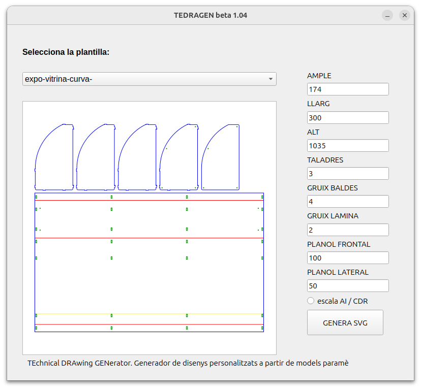
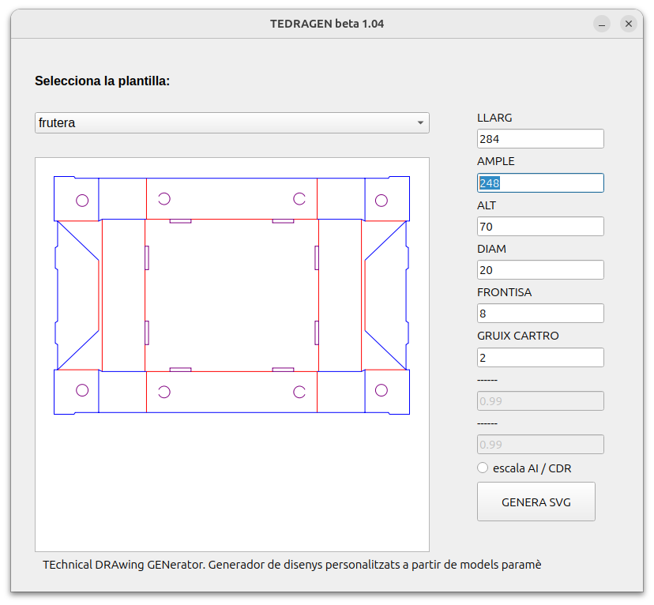
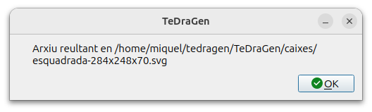

# TeDraGen
Python app to draw box templates, point-of-sale display (PLV) templates, and modular furniture templates from parametrized models

This is an small app developed before learnig to code in DAM, while i was working in a company that worws with CNC routing machines, laser, etc.

I was boring to reescale some template drawings to diferent sizes, and this is a kind of making parametrice of some models.

Now i'm improving in programming models and I'm not proud of thr code of this development, but i share it if in case someone feels interesting.

Basicly, generates a SVG drawing templatre from a Json with the parameters formula, with a really basic UI. Some versions without any UI, working in terminal, used in the production in the endpoint PC to the laser cutters, to cut the boxes generated on the fly.

Happy boxing!